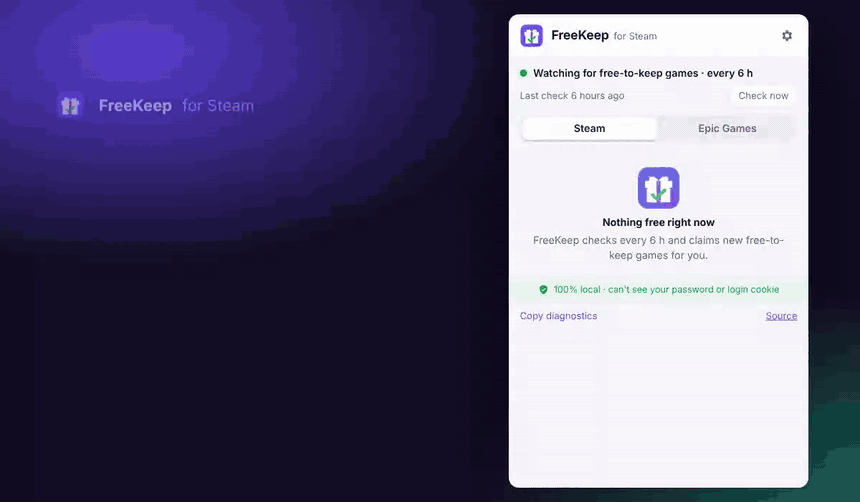
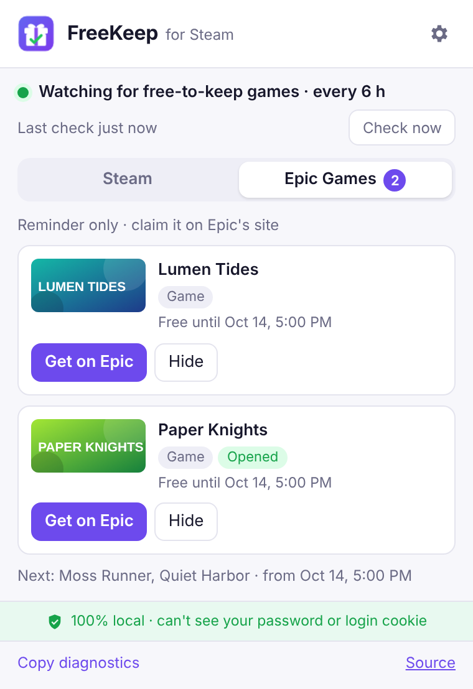

<div align="center">


# FreeKeep for Steam

**Never miss a free Steam game again.**
A tiny browser extension that claims Steam's free-to-keep promotions for you, in the background,
using the Steam login your browser already has.

🔒 **Your credentials never leave your computer.**

[繁體中文](README.zh-TW.md) · [Install](#install) · [How it works](#how-it-works) · [Privacy](PRIVACY.md)



</div>

## 🔒 Privacy first

Most auto-claimers need your Steam password, a session token or cookies, stored in a bot, a server
or a config file. **FreeKeep never asks for any of them.** It runs entirely inside your own browser
and lets the browser attach the login it already has, exactly like when you open the Steam store.

| | Typical bots & scripts | FreeKeep |
|---|---|---|
| Asks for your password, token or cookies | Usually | **Never** |
| Runs on | A bot, a server or an always-on machine | **Your own browser** |
| Your Steam login | Copied into their config | **Stays in your browser, untouched** |
| Talks to | Their server, Discord, third-party APIs | **Only `store.steampowered.com`**¹ |
| Collects data | Varies | **Nothing. No server, no analytics** |
| Auditable | Varies | **~40 KB of code, open source** |

¹ Plus Epic's public list of free games, only if you turn on the optional
[Epic reminders](#epic-games-store-reminders). That request carries no login and no cookies.

Read the [privacy policy](PRIVACY.md) and the [architecture notes](docs/ARCHITECTURE.md).

## Features

- **Claims free-to-keep games automatically.** Only real limited-time promotions (Steam's own
  "Limited Free Promotional Package"), never demos, playtests or free-to-play games.
- **Zero credentials, 100% local.** No password, no token, no server. Nothing is opened, clicked or
  sent anywhere except `store.steampowered.com`.
- **Knows your library.** Skips games you own, and claims DLC only when you own the base game
  (Steam would reject it otherwise).
- **Quiet by default.** One notification when something was claimed, or when it needs you.
- **Your schedule.** Check every 1, 3, 6, 12 or 24 hours, plus once when the browser starts.
  Missed checks run when your computer wakes up.
- **Auto or ask.** Claim instantly, or get a notification and decide yourself.
- **Optional Epic Games Store reminders.** Get told when Epic gives a game away, with a link to
  claim it yourself. Off by default; [details below](#epic-games-store-reminders).
- **Tiny and auditable.** About 40 KB of code, zero runtime dependencies, TypeScript, unit-tested.
- **12 languages.** English, 繁體中文, 简体中文, Русский, Español, Português, Deutsch, 日本語, Français,
  Polski, 한국어, Türkçe. [Help translate](CONTRIBUTING.md#translations).

## Install

| Browser | How |
|---|---|
| Chrome, Edge, Brave, Opera | Chrome Web Store (coming soon) |
| Any Chromium browser, manually | Download `freekeep-for-steam-*-chrome.zip` from [Releases](../../releases), unzip it, open `chrome://extensions`, enable **Developer mode**, click **Load unpacked** and pick the folder |

Then make sure you're logged in to the [Steam store](https://store.steampowered.com/) in the same
browser. That's it.

> Manual installs don't auto-update. Steam changes its site from time to time, so watch the
> repository's releases or prefer the store version once it's out.

## How it works

```
every N hours (and at browser start)
  └─ search the store for 100%-off items           GET /search/results?maxprice=free&specials=1
      └─ new app? read its packages                GET /api/appdetails
          └─ keep "Limited Free Promotional Package" subs
              └─ compare with your library          GET /dynamicstore/userdata
                  └─ claim, one at a time            POST /freelicense/addfreelicense/<subid>
```

That last request is the same one Steam's own **Add to Account** button sends. Steam answers with a
result code that FreeKeep understands (`9` already owned, `24` base game required). Failed claims are
retried up to three times. See [docs/ARCHITECTURE.md](docs/ARCHITECTURE.md) for details.

### Epic Games Store reminders

In the settings, turn on **Remind me of free games on the Epic Games Store** and FreeKeep also
watches Epic's weekly giveaways. It **only reminds you**: a notification when a new free game starts,
a list in the popup with a **Get on Epic** button, and a heads-up for next week's games. You claim
them on Epic's site.

<p align="center"></p>

- Epic's list is public, so FreeKeep reads it anonymously, with no Epic account, no login and no
  cookies. Only your browser's language is sent, so game names match Epic's site; your country and
  Steam data are not.
- Turning it on asks your browser for one extra permission, to read
  `store-site-backend-static-ipv4.ak.epicgames.com`. Turning it off gives the permission back.
  Chrome's extension page may still list that site, because Chrome remembers you allowed it once
  and won't ask again if you turn it back on, but FreeKeep can no longer reach it.
- If you never turn it on, FreeKeep never contacts Epic.

### Permissions

| Permission | Why |
|---|---|
| `store.steampowered.com` | Find promotions, read your library, claim games |
| `storage` | Remember settings and which promotions were handled, on your device only |
| `alarms` | Run the periodic check |
| `notifications` | Tell you when something was claimed or needs attention |
| `store-site-backend-static-ipv4.ak.epicgames.com` (optional) | Read Epic's public list of free games, only after you turn on Epic reminders |

No `tabs`, no `scripting`, no `cookies`, no access to any other site.

## FAQ

**Is my account safe?** FreeKeep never sees your password, and it can't read your login cookie:
Steam marks it `HttpOnly` and FreeKeep has no `cookies` permission. The browser attaches your
existing Steam login to requests for `store.steampowered.com`, exactly like when you visit the store.
The code is small enough to read in one sitting.

**Is this allowed by Steam?** FreeKeep sends the same request as clicking *Add to Account*, at a
gentle pace. Still, it is unofficial automation: use it at your own risk. Not affiliated with Valve.

**Does it work on new or limited accounts?** Yes, it was tested on a brand-new account.

**Why doesn't it claim Epic games automatically?** On Steam, a free license is one request, the same
one the *Add to Account* button sends. On Epic, getting a game goes through its checkout page.
Automating that would mean scripting Epic's website or handling your Epic login, which breaks
FreeKeep's rule of never touching your credentials. So for Epic, FreeKeep reminds you instead.

**Why wasn't a DLC claimed?** Steam only lets you claim a DLC if you own its base game. FreeKeep shows
those as *Needs base game* and claims them automatically if you get the base game while the promo
is running.

**Something broke.** Open the popup, click **Copy diagnostics** and paste it into an
[issue](../../issues). The report contains no account data.

## Development

```bash
npm install
npm run dev        # Chrome with hot reload
npm test           # unit tests
npm run compile    # type check
npm run build      # .output/chrome-mv3
npm run zip        # store-ready zip
```

The demo above is rendered from the real popup: `npm run build && node scripts/demo/record.mjs en`
(needs Playwright and ffmpeg). The Epic screenshot comes from `npm run epic-shot`.

### Translations

FreeKeep speaks 12 languages, and you can add yours in a few minutes: copy
[`public/_locales/en/messages.json`](public/_locales/en/messages.json), translate it and open a pull
request. Native speakers reviewing the machine-assisted languages are just as welcome. See
[CONTRIBUTING.md](CONTRIBUTING.md#translations) for the status table and steps.

## Contact

Maintained by [@SmailDot](https://github.com/SmailDot). Questions, bugs and ideas:
[open an issue](../../issues) or email [smaildot@aidot.me](mailto:smaildot@aidot.me).

## License

Code: [MIT](LICENSE). The FreeKeep name and logo are not covered by the license; please don't
publish forks or copies under that name or with that logo.

Steam is a trademark of Valve Corporation. FreeKeep is not affiliated with or endorsed by Valve.
