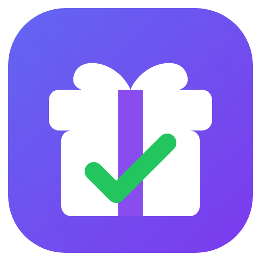
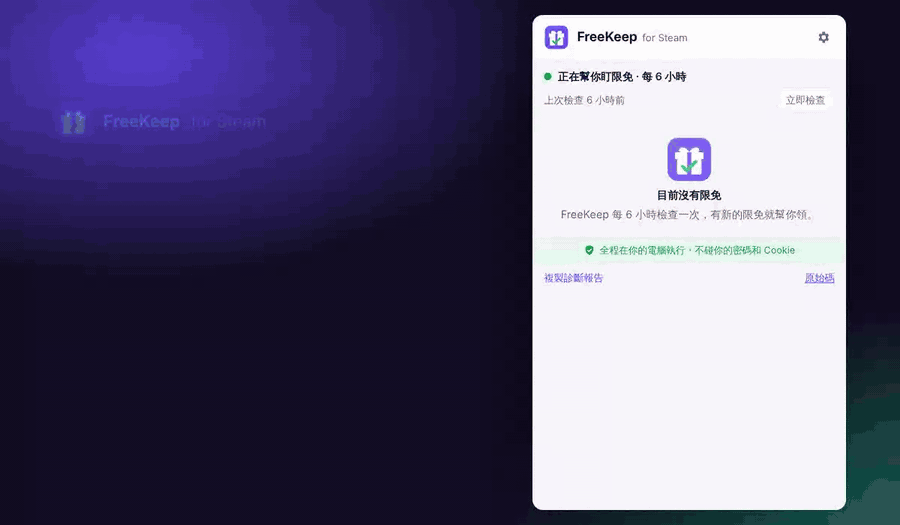
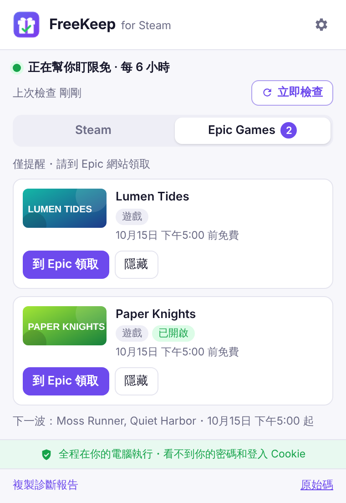

<div align="center">



# FreeKeep for Steam

**自動領取 Steam 限免遊戲，全程不需要提供密碼。**
輕量的瀏覽器擴充功能，在背景自動領取 Steam 限時免費遊戲，並可選擇開啟 Epic Games Store 限免提醒。

🔒 **不需密碼、不讀取登入憑證、不經過任何伺服器，所有動作都在你的瀏覽器內完成。**

[English](README.md) · [為什麼安全](#-為什麼安全) · [安裝](#安裝) · [運作原理](#運作原理) · [隱私權](PRIVACY.md)



</div>

## 🔒 為什麼安全

自動領取工具若要求提供密碼或登入憑證，帳號安全就取決於第三方。FreeKeep 從設計上就不需要這些資料：

1. **沿用瀏覽器既有的登入狀態**
   登入 Steam 後，瀏覽器每次連線到 Steam 商店都會自動附上你的登入狀態。FreeKeep 只發出與 Steam
   「加入帳戶」按鈕相同的領取請求，身分驗證由瀏覽器完成。
2. **無法讀取你的登入憑證**
   Steam 的登入憑證設有 HttpOnly 保護，網頁程式與擴充功能都無法讀取；FreeKeep 也沒有申請 Cookie 權限。
3. **不經過任何伺服器**
   FreeKeep 沒有後端伺服器，不上傳、也不蒐集任何資料。
4. **可自行查證**
   在 Chrome 擴充功能的「詳細資料」頁面，可以看到 FreeKeep 只有通知權限與 Steam 商店的存取權
   （開啟 Epic 提醒時另含 Epic 公開清單）。[原始碼](src/)完整公開。

### 與常見自動領取工具的比較

| | 常見的自動領取工具 | FreeKeep |
|---|---|---|
| 需要密碼或登入憑證 | 多數需要 | **不需要** |
| 領取方式 | 開啟商店分頁模擬點擊，或在伺服器上登入 | **在背景送出單一請求，不開分頁** |
| 執行位置 | 多在機器人、伺服器或常駐主機上 | **你的瀏覽器** |
| 登入資料 | 複製到工具的設定檔或伺服器 | **始終留在瀏覽器中** |
| 連線對象 | 工具的伺服器、Discord 或其他第三方服務 | **僅限 Steam 商店**¹ |
| 資料蒐集 | 視工具而定 | **不蒐集，無分析、無追蹤** |
| 原始碼 | 視工具而定 | **開源，約 40 KB** |

¹ 開啟選用的 [Epic 限免提醒](#epic-games-store-限免提醒)後，另會讀取 Epic 公開的限免清單，該請求不含任何登入資訊。

詳細內容請參閱[隱私權政策](PRIVACY.md)與[架構說明](docs/ARCHITECTURE.md)。

## 功能

- **自動領取限免遊戲**：只領取 Steam 官方的限時免費促銷（Limited Free Promotional Package），
  不包含試玩版、Playtest 與免費遊玩遊戲
- **不需憑證、完全在本機執行**：不需密碼或 Token，沒有伺服器；除了 Steam 商店不連線到任何地方，
  也不會開啟分頁或替你點擊
- **比對你的收藏庫**：自動略過已擁有的遊戲；DLC 僅在擁有本體時領取（否則 Steam 也會拒絕）
- **依你的地區判斷**：使用你的 Steam 商店地區，只領取該地區實際提供的限免
- **低干擾通知**：僅在領取成功或需要你處理時通知
- **彈性排程**：每 1、3、6、12 或 24 小時檢查一次，瀏覽器啟動時也會檢查；電腦休眠期間錯過的檢查會在喚醒後補執行
- **自動或先確認**：可直接自動領取，或先通知再由你決定
- **選用的 Epic Games Store 限免提醒**：Epic 推出免費遊戲時通知你，並附上領取連結；預設關閉，
  [詳見下方](#epic-games-store-限免提醒)
- **輕量、可審查**：程式碼約 40 KB，無執行期依賴，以 TypeScript 撰寫並具備單元測試
- **12 種語言**：English、繁體中文、简体中文、Русский、Español、Português、Deutsch、日本語、Français、
  Polski、한국어、Türkçe，[歡迎協助翻譯](CONTRIBUTING.md#translations)

## 安裝

| 瀏覽器 | 方式 |
|---|---|
| Chrome、Edge、Brave、Opera | Chrome 線上應用程式商店（即將上架） |
| 任何 Chromium 瀏覽器（手動） | 到 [Releases](../../releases) 下載 `freekeep-for-steam-*-chrome.zip` → 解壓縮 → 開啟 `chrome://extensions` → 開啟「開發人員模式」→「載入未封裝項目」→ 選擇資料夾 |

安裝後，在同一個瀏覽器登入 [Steam 商店](https://store.steampowered.com/)即可開始使用。

> 手動安裝的版本不會自動更新。Steam 偶爾會調整網站，建議留意 Releases，或在商店版上架後改用商店版。

## 運作原理

```
每 N 小時（以及瀏覽器啟動時）
  └─ 搜尋商店裡 100% 折扣的項目                    GET /search/results?maxprice=free&specials=1
      └─ 新的 app？讀取它的 package                 GET /api/appdetails
          └─ 只留下「Limited Free Promotional Package」
              └─ 跟你的收藏庫比對                    GET /dynamicstore/userdata
                  └─ 一個一個領取                     POST /freelicense/addfreelicense/<subid>
```

最後一個請求與 Steam 商店頁「加入帳戶」按鈕送出的請求相同。FreeKeep 會解讀 Steam 回傳的結果碼
（`9` 已擁有、`24` 需要本體），失敗時最多重試三次。詳細說明請見 [docs/ARCHITECTURE.md](docs/ARCHITECTURE.md)。

### Epic Games Store 限免提醒

在設定中開啟「**提醒我 Epic Games Store 的免費遊戲**」後，FreeKeep 也會追蹤 Epic 每週的限免活動。
此功能**僅提供提醒**：新的限免開始時通知一次、在 popup 中列出遊戲並提供「**到 Epic 領取**」按鈕，
同時預告下週的遊戲。領取需在 Epic 網站上完成。

<p align="center"></p>

- Epic 的限免清單是公開資料，FreeKeep 以匿名方式讀取，不需要 Epic 帳號，也不附帶登入資訊或 Cookie。
  請求中只包含瀏覽器語言（讓遊戲名稱與 Epic 官網一致），不含你的國家或 Steam 資料
- 開啟時，瀏覽器會請你授權一項額外權限：讀取 `store-site-backend-static-ipv4.ak.epicgames.com`；
  關閉時會一併移除該權限。Chrome 的擴充功能頁面可能仍會列出此網址，這是因為 Chrome 會記住你曾經授權、
  下次開啟時不再詢問，但 FreeKeep 實際上已無法連線
- 未開啟此功能時，FreeKeep 不會與 Epic 有任何連線

### 權限

| 權限 | 用途 |
|---|---|
| `store.steampowered.com` | 搜尋限免、比對收藏庫、領取遊戲 |
| `storage` | 在你的裝置上儲存設定與已處理的限免 |
| `alarms` | 定時檢查 |
| `notifications` | 領取成功或需要你處理時通知你 |
| `store-site-backend-static-ipv4.ak.epicgames.com`（選用） | 開啟 Epic 提醒後，讀取 Epic 公開的限免清單 |

不使用 `tabs`、`scripting`、`cookies` 權限，也無法存取其他網站。

## 常見問題

**帳號安全嗎？** FreeKeep 無法得知你的密碼，也無法讀取你的登入憑證：Steam 為其設定了 HttpOnly 保護，
而 FreeKeep 沒有 Cookie 權限。登入狀態由瀏覽器在連線到 Steam 商店時自動附上，與你平常瀏覽商店相同。
原始碼完整公開，任何人都可以檢視。

**Steam 允許這樣做嗎？** FreeKeep 送出的請求與按下「加入帳戶」相同，且頻率很低。不過它仍屬於非官方的自動化工具，
請自行評估使用風險。本專案與 Valve 無關。

**新帳號或受限帳號可以使用嗎？** 可以，已在全新帳號上實測成功。

**為什麼 Epic 的遊戲不能自動領取？** Steam 的免費授權只需要一個請求，與「加入帳戶」按鈕相同；
Epic 則必須經過結帳流程。要自動化就得操控 Epic 網站或處理你的 Epic 登入資訊，這違反 FreeKeep
「不接觸使用者憑證」的原則，因此 Epic 改以提醒的方式支援。

**別人領到的免費遊戲，為什麼 FreeKeep 沒有偵測到？** 通常是以下兩種原因之一：

- **地區限定**：FreeKeep 依你的 Steam 商店地區判斷，部分限免只在特定國家提供
- **並非 Steam 限免活動**：有些開發者將新遊戲設為「免費遊玩」，只在遊戲介紹中說明「期間內加入可永久保留」。
  這類遊戲在 Steam 上沒有可領取的限免項目，請直接到商店頁將遊戲加入收藏庫

**為什麼 DLC 沒有被領取？** Steam 只允許擁有本體的帳號領取 DLC。FreeKeep 會將這類項目標示為「缺少本體」，
若你在限免期間取得本體，它會自動補領。

**明明已登入，FreeKeep 卻顯示未登入？** 請在同一個瀏覽器開啟 Steam 商店，確認右上角顯示你的帳號名稱，
再按「立即檢查」。曾有一例在剛安裝後仍持續顯示未登入，移除後從 Chrome 線上應用程式商店重新安裝即恢復正常。
如果你遇到這個情況，請按「複製診斷報告」並開 Issue：報告中包含最近一次登入檢查的結果，不含任何帳號資料。

**遇到問題怎麼辦？** 開啟 popup，按「複製診斷報告」，貼到 [Issues](../../issues)。報告中不含任何帳號資料。

## 開發

```bash
npm install
npm run dev        # 開啟 Chrome 並熱重載
npm test           # 單元測試
npm run compile    # 型別檢查
npm run build      # 輸出到 .output/chrome-mv3
npm run zip        # 打包成可上架的 zip
```

上面的示範動畫是用真實的 popup 錄製的：`npm run build && node scripts/demo/record.mjs zh_TW`
（需要 Playwright 和 ffmpeg）。Epic 分頁的截圖則由 `npm run epic-shot` 產生。

### 翻譯

FreeKeep 目前支援 12 種語言，加入新語言只要幾分鐘：複製
[`public/_locales/en/messages.json`](public/_locales/en/messages.json)、翻譯後發 Pull Request 即可。
也非常歡迎母語者校正機器輔助翻譯的語言。語言狀態表與步驟請見 [CONTRIBUTING.md](CONTRIBUTING.md#translations)。

## 聯絡

由 [@SmailDot](https://github.com/SmailDot) 維護。問題、回報或建議：
[開 Issue](../../issues) 或寄信到 [smaildot@aidot.me](mailto:smaildot@aidot.me)。

## 授權

程式碼採 [MIT](LICENSE) 授權。「FreeKeep」名稱與 logo 不在授權範圍內，請勿以此名稱或 logo 發布分支或複製版本。

Steam 是 Valve Corporation 的商標，FreeKeep 與 Valve 無關，也未獲其背書。
